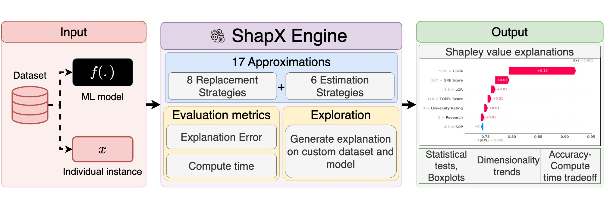
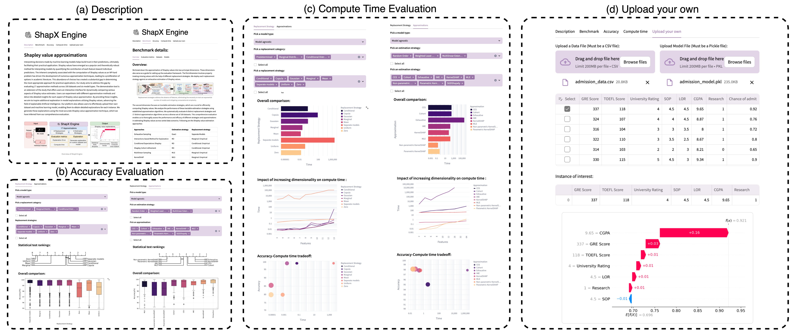

<h1 align="center">ShapX Engine</h1>
<h2 align="center">A Demonstration of Shapley Value Approximations</h2>

## 📄 Contents
1. [Overview](#overview)
2. [Get Started](#start)
3. [Evaluation](#evaluation)
   
<h2 id="overview"> 1. Overview </h2>

Interpreting decisions made by machine learning models helps build trust in their predictions, ultimately facilitating their practical application. Shapley values have emerged as a popular and theoretically robust method for interpreting models by quantifying the contribution of each feature toward individual predictions. The inherent complexity associated with the computation of Shapley values as an NP-hard problem has driven the development of numerous approximation techniques, leading to a plethora of options in literature. This abundance of choices has created a substantial gap in determining the most appropriate approach for practical applications. To address this gap, we propose ShapX, a web engine that comprehensively evaluates 17 approximation methods across diverse regression and classification tasks. ShapX facilitates an interactive exploration of the strengths and limitations of various Shapley value approximations by guiding users through the suitable selections of replacement and tractable estimation strategies. Ultimately, our study reveals that strategies competent at capturing all the feature interactions leading to accurate estimations of Shapley values. ShapX also allows users to effortlessly upload their own dataset along with the corresponding machine learning model, enabling them to obtain detailed individualized explanations. A detailed walkthrough video of the demonstration is available online: [Video](https://youtu.be/5uPocjPUAA8).

<h2 id="start"> 2. Get Started </h2>
We introduce the novel [ShapX Engine](https://shapleyexplanations.streamlit.app/) a modular web engine crafted to enhance the exploration of the multifaceted Shapley value estimation. As demonstrated in the below figure, the engine comprises five primary frames: \textbf{(a) Description, (b) Benchmark Details, (c) Accuracy Evaluation, (d) Compute Time, and (e) Interactive Explanations}. The Description frame provides a compelling rationale for the necessity of a web engine and presents a comprehensive user guide to assist individuals in effectively navigating through the engine. The Benchmark Details provide essential details like the various approximations integrated into the engine, diverse evaluation metrics employed, and the datasets and models utilized to demonstrate the evaluation.

Within the Accuracy Evaluation frame, the focus is on analyzing the performance variability across different dimensions of Shapley value estimation. This frame presents a boxplot and a critical difference diagram for comparing relative accuracy rankings to aid in visualization. Moreover, it supports the investigation of performance variability through diverse replacement and tractable estimation approaches, facilitating a more thorough exploration. In the Compute Time frame, we display the computation time of Shapley values per instance. We offer a selection of replacement and estimation strategies for detailed comparison. The results are presented through visualizations, including bar plot comparison, line plots illustrating the impact of dimensionality, and bubble plots demonstrating the tradeoff between accuracy and compute time.

The Interactive Explanations frame helps users understand their dataset better and provides explanations for any model trained on that dataset. Users are required to upload a CSV data file and a pickle model file, followed by selecting the instance to be explained. The engine then generates Shapley values for the instance using the most effective explanation technique and produces a plot illustrating the Shapley values for each feature. 

<h2 id="evaluation"> 3. Evaluation </h2>

We break down the approximation of Shapley values into two
principal dimensions. These dimensions also serve as a guide for
setting up the evaluation framework. The first dimension involves
properly treating missing values with the help of different replacement strategies. We deploy each replacement strategy against an
exhaustive estimation of Shapley values. This evaluation measure
will highlight the strengths and weaknesses of replacement strategies, aiding future research in selecting the most reliable strategy.

The second dimension focuses on tractable estimation strategies,
which are crucial for efficiently computing Shapley values. We analyze the performance of these tractable estimation strategies using
established approximation algorithms. We systematically evaluate
8 distinct replacement strategies and 17 distinct approximation algorithms across a diverse set of 100 datasets. This comprehensive
evaluation enables us to thoroughly assess the performance and
efficacy of different strategies and approximations in estimating
Shapley values across varied data scenarios.

| Approaches                                | Estimation Strategy                   | Replacement Strategy                                             |
|-------------------------------------------|---------------------------------------|------------------------------------------------------------------|
| Exhaustive Sampling                       | Exact (All potential feature subsets) | Conditional Distribution: Separate Models                        |
| Interactions-based Method for Explanation | Random Order                          | Marginal Distribution: Empirical                                 |
| Conditional Expectations Shapley          | Random Order                          | Conditional Distribution: Empirical                              |
| Shapley Cohort refinement                 | Random Order                          | Conditional Distribution: Empirical                              |
| Multilinear Sampling                      | Multilinear Extension                 | Marginal Distribution: Empirical                                 |
| KernelSHAP                                | Weighted Least Squares                | Marginal Distribution: Empirical                                 |
| Parametric KernelSHAP                     | Weighted Least Squares                | Conditional Distribution: Parametric Assumption(Gaussian/Copula) |
| Non-Parametric KernelSHAP                 | Weighted Least Squares                | Conditional Distribution: Empirical                              |
| SGD-Shapley                               | Weighted Least Squares                | Predetermined Baseline: Mean                                     |
| FastSHAP                                  | Weighted Least Squares                | Conditional Distribution: Surrogate model                        |
| Independent LinearSHAP                    | Linear                                | Marginal Distribution: Empirical                                 |
| Correlated LinearSHAP                     | Linear                                | Conditional Distribution: Parametric Assumption(Gaussian)        |
| Tree Interventional                       | Tree                                  | Marginal Distribution: Empirical                                 |
| Tree Path-dependent                       | Tree                                  | Conditional Distribution: Empirical                              |
| DeepLIFT                                  | Deep                                  | Predetermined Baseline: All-zeros                                |
| DeepSHAP                                  | Deep                                  | Marginal Distribution: Empirical                                 |
| DASP                                      | Deep                                  | Predetermined Baseline: Mean                                     |

